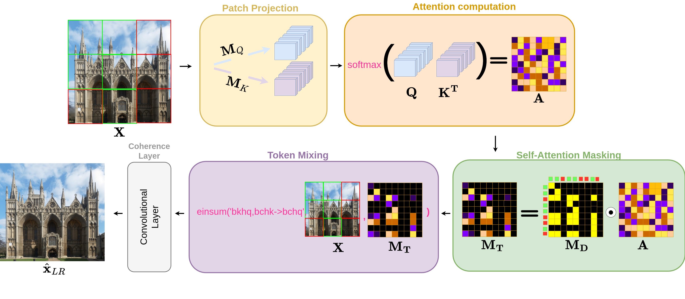

<figure align="center">
  

  <figcaption>Left: Inpainting result on ultra high-resolution images. Right: Comparison of LPIPS performance and Latency among different state-of-the-art methods..</figcaption>
</figure>

## Abstract

Existing image inpainting methods have shown impressive completion results for low-resolution images. However, most of these algorithms fail at high resolutions and require powerful hardware, limiting their deployment on edge devices. Motivated by this, we propose the first baseline for REal-Time High-resolution image INpainting on Edge Devices (RETHINED) that is able to inpaint at ultra-high-resolution and can run in real-time ($\leq$ 30ms) in a wide variety of mobile devices. A simple, yet effective novel method formed by a lightweight Convolutional Neural Network (CNN) to recover structure, followed by a resolution-agnostic patch replacement mechanism to provide detailed texture. Specially our pipeline leverages the structural capacity of CNN and the high-level detail of patch-based methods, which is a key component for high-resolution image inpainting. To demonstrate the real application of our method, we conduct an extensive analysis on various mobile-friendly devices and demonstrate similar inpainting performance while being 100x than existing state-of-the-art 
methods. Furthemore,
we realease DF8K-Inpainting, the first free-form mask UHD inpainting dataset.

## Method

<figure align="center"  style="margin-top: 2em; margin-bottom: 2em">
  
  <figcaption><strong>Proposed Inpainting Pipeline.</strong> Given a HR image <i>y</i> and a binary mask <i>m</i> with corrupted pixels as inputs (left), our model first downsamples <i>x</i> = <i>y</i> ⊙ <i>m</i> to a lower resolution <i>x</i>LR, and forwards it to the coarse model <i>f</i>θ obtaining <i>x̂</i>coarse. It is then refined by the NeuralPatchMatch module obtaining <i>x̂</i>LR and the attention map <b>A</b>. From <b>A</b> and <i>x</i>, our Attention Upscaling module yields <i>x̂</i>HR.</figcaption>
</figure>

Given a high-resolution RGB image $\mathbf{y} \in \mathbb{R}^{H_{\text{HR}}\times W_{\text{HR}}\times 3}$ (where $H_{\text{HR}}$ and $W_{\text{HR}}$ denote, respectively, the height and width of the high-resolution image in pixels) and a binary mask $\mathbf{m} \in \mathbb{R}^{H_{\text{HR}}\times W_{\text{HR}}}$ containing the corrupted pixels, our goal is to fill-in with plausible information the masked image $\mathbf{x} = \mathbf{y} \odot \mathbf{m}$.
To achieve this goal, we first downsample $\mathbf{x}$ to a lower resolution obtaining $\mathbf{x_{\text{LR}}}\in \mathbb{R}^{H\times W\times 3}$ (where $H<H_{\text{HR}}$ and $W<W_{\text{HR}}$) and forward it to the coarse model, obtaining the coarse inpainted image $\hat{\mathbf{x}}_{\text{coarse}}$ of size $H\times W$ . Then, we use the NeuralPatchMatch module to refine $\hat{\mathbf{x}}_{\text{coarse}}$ by propagating known content from the input image $\mathbf{x_{\text{LR}}}$, obtaining $\hat{\mathbf{x}}_{\text{LR}}$ and the corresponding attention map $\mathbf{A}$.
Finally our Attention Upscaling  module uses the learned attention map $\mathbf{A}$ and $\mathbf{x}$ to resemble high texture details found on the base image, finally obtaining a high-resolution image $\hat{\mathbf{x}}_{\text{HR}}$.

<figure align="center" style="margin-top: 2em; margin-bottom: 2em">
  
  <figcaption>Figure 3. <strong>Proposed NeuralPatchMatch Inpainting Module.</strong> (Corrupted patches are displayed as red  while uncorrupted ones as green .) First, we project patch embedding to embedding space of dimension <i>dk</i> (Sect. 3.2). Then token similarity is computed in a self-attention manner, obtaining attention map <b>A</b> (where lighter colors  correspond to a large softmax value while darker colors  correspond to a low value). The self-attention masking allows to inpaint only on corrupted regions, maintaining high-frequency details from uncorrupted zones. To obtain the final inpainted image, we mix the tokens via a weighted sum based on the attention map <b>A</b>.</figcaption>
</figure>

## Results